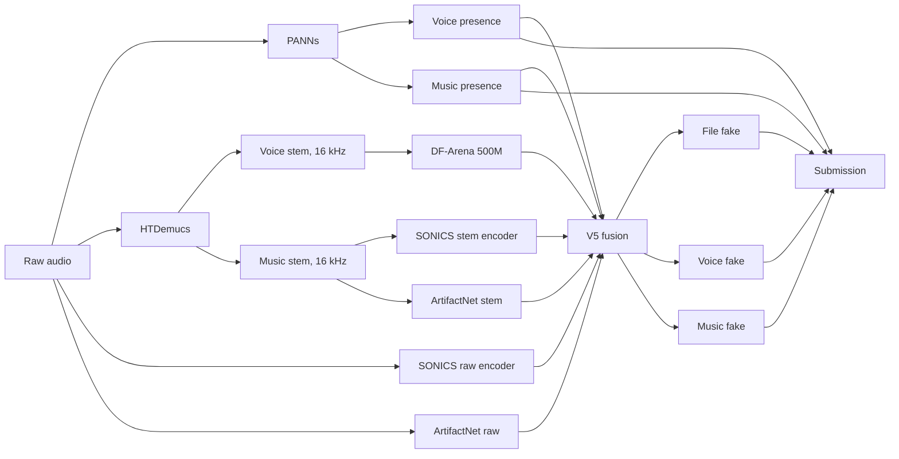

# DeepVoice V5

V5 trains a small fusion network over frozen detector outputs:

- HTDemucs voice and music stems
- DF-Arena 500M voice score
- SONICS raw and music-stem embeddings
- transient ArtifactNet and PANNs scores

Only the expensive reusable features are cached. Preparation resumes per sample;
training resumes from atomic optimizer checkpoints.

## Pipeline



DF-Arena always receives the separated voice stem. SONICS receives both raw
audio and the separated music stem. See [the pipeline document](docs/pipeline.md)
for feature shapes, caching, resume behavior, batching, and deployment details.

## Prepare features

```bash
PYTORCH_CUDA_ALLOC_CONF=expandable_segments:True \
  .venv/bin/python3 tools/prepare_v5.py prepare \
  --manifest /path/to/manifest.csv \
  --cache-dir /path/to/cache \
  --device cuda
```

An existing unversioned cache must be adopted once:

```bash
.venv/bin/python3 tools/prepare_v5.py adopt-cache \
  --manifest /path/to/manifest.csv \
  --cache-dir /path/to/cache
```

Use the `status` command with the same arguments to validate cache coverage.

## Train or resume

```bash
.venv/bin/python3 tools/train_v5.py \
  --manifest /path/to/manifest.csv \
  --cache-dir /path/to/cache \
  --run-dir /path/to/run \
  --device cuda

# Continue from runs/v5_fusion/last.pt
.venv/bin/python3 tools/train_v5.py \
  --manifest /path/to/manifest.csv \
  --cache-dir /path/to/cache \
  --run-dir /path/to/run \
  --device cuda --resume
```

The run directory contains `last.pt`, validation-Score-selected `best.pt`, epoch
checkpoints, predictions, metrics, history, and JSONL events.

## Verify

```bash
.venv/bin/python3 -m pytest -q
```

## Infer and package

```bash
.venv/bin/python3 script.py \
  --test-dir data/test \
  --sample-submission data/sample_submission.csv \
  --output output/submission.csv

./package_submission.sh submit.zip
```

Inference is offline and sequentially releases each frozen model to keep GPU
memory bounded. All weights, including `model/v5_fusion.pt`, must exist under
`model/`; large weights are intentionally excluded from Git.
