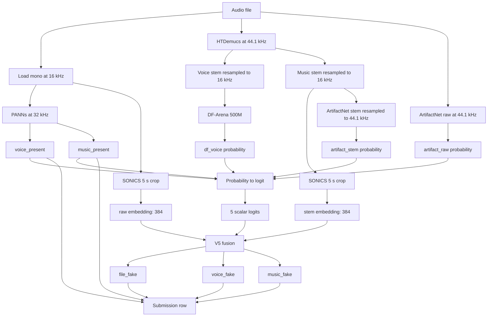
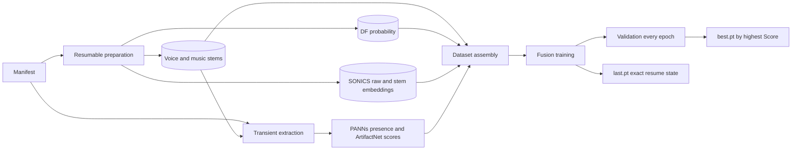

# V5 pipeline

V5 freezes every detector and trains only a compact fusion network. Training
and deployment use the same preprocessing and feature order.

## Inference

The fusion model projects each SONICS embedding to 64 dimensions. Its input is
the five scalar logits plus the raw projection, stem projection, their absolute
difference, and their elementwise product: `5 + 4 × 64 = 261` values. A
`261 → 128 → 64 → 3` network produces file, voice, and music fake logits.

PANNs presence probabilities bypass the fusion outputs and are written directly
to the submission alongside the three learned fake probabilities.

## Training

Only reusable expensive features are cached:

| Cache | Contents | File granularity |
|---|---|---:|
| `stems_cache` | 16 kHz voice and music stems | one NPZ per sample |
| `df_cache` | DF-Arena voice-fake probability | one NPZ per sample |
| `sonics_cache` | raw and music-stem embeddings | one NPZ per sample |

PANNs and ArtifactNet are recomputed when training starts. They are relatively
cheap and are kept out of the persistent cache.

File-fake loss is always active. Voice-fake and music-fake losses are masked out
when the corresponding ground-truth component is absent. The validation
competition Score—not binary cross-entropy—selects `best.pt`.

## Resume contract

Preparation validates every cached item before reuse. `cache_metadata.json`
binds a cache to the manifest SHA-256, sample rate, preprocessing version, and
model identities. Writes are atomic, so interruption loses at most the active
sample batch.

`last.pt` contains the model, optimizer, scheduler, epoch, batch offset, step,
partial loss, metric history, best Score, and Python/NumPy/PyTorch RNG states.
Restart training with `--resume`; incompatible configuration or cache contracts
are rejected.

## Batching and memory

| Stage | Preparation | Deployment |
|---|---:|---:|
| PANNs | one file | one file |
| HTDemucs | 2 | one file |
| DF-Arena 500M | 4 | 4 |
| SONICS | 16 | 16 |
| ArtifactNet | one file | one file |
| Fusion | 16 | 256 |

Deployment loads PANNs, HTDemucs, DF-Arena, and SONICS sequentially and releases
each before loading the next. Audio and stems remain in host RAM. This avoids
holding all large models in VRAM simultaneously and allows the pipeline to run
on the 8 GB GTX 1080 used for smoke testing.

## Output contract

`script.py` requires one audio file for every `ID` in the sample-submission CSV
and rejects missing, extra, or duplicate IDs. It writes:

1. `FILE_FAKE_PROB`
2. `VOICE_FAKE_PROB`
3. `MUSIC_FAKE_PROB`
4. `VOICE_PRESENT_PROB`
5. `MUSIC_PRESENT_PROB`

Inference is offline. The deployable checkpoint is `model/v5_fusion.pt`; the
submission archive contains only `model/`, `script.py`, and `requirements.txt`.
